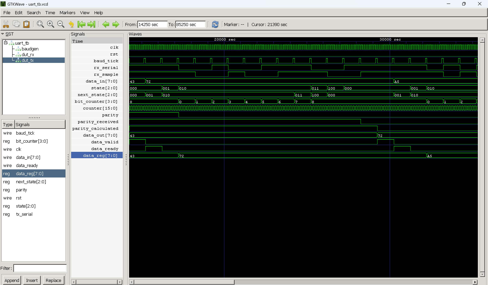

# UART FIFO Design using Verilog HDL

## Overview

This project implements a UART (Universal Asynchronous Receiver Transmitter) communication system with FIFO buffering using Verilog HDL. The design enables reliable serial data transmission and reception while temporarily storing data in a FIFO buffer for smooth data handling between modules operating at different rates.

The design was verified through simulation using Icarus Verilog and GTKWave.

## Features

- UART Transmitter (TX)
- UART Receiver (RX)
- FIFO Buffer Integration
- Baud Rate Generation
- Serial Data Communication
- Data Valid and Ready Handshaking
- Simulation-Based Verification

## Design Architecture

UART communication consists of:

1. UART Transmitter
   - Converts parallel data into serial format.
   - Adds start bit, parity bit, and stop bit.

2. UART Receiver
   - Detects start bit.
   - Samples incoming serial data.
   - Checks parity.
   - Reconstructs received data.

3. FIFO Buffer
   - Temporarily stores received data.
   - Supports efficient data transfer between modules.

4. Baud Rate Generator
   - Generates baud ticks required for UART timing.

## Project Files

| File | Description |
|--------|------------|
| uart_tx.v | UART Transmitter |
| uart_rx.v | UART Receiver |
| fifo.v | FIFO Buffer |
| baud_gen.v | Baud Rate Generator |
| UART_FIFO.v | Top Module |
| uart_tb.v | Testbench |
| uart_tb.vcd | Simulation Waveform |

---

## Simulation Results

The following test vectors were transmitted and received successfully:

| Expected Data | Received Data |
|--------------|--------------|
| 0x43 | 0x43 |
| 0x72 | 0x72 |
| 0xA5 | 0xA5 |
| 0xE7 | 0xE7 |
| 0xF4 | 0xF4 |

Simulation Console Output:

```text
Received: 43 | Expected: 43
Received: 72 | Expected: 72
Received: a5 | Expected: a5
Received: e7 | Expected: e7
Received: f4 | Expected: f4
```

All transmitted data was received correctly, confirming successful UART communication.

---

## Tools Used

- Verilog HDL
- Icarus Verilog
- GTKWave
- GitHub

---

## Waveform




## Applications

- Serial Communication Systems
- Embedded Systems
- FPGA-Based Designs
- Communication Interfaces
- Digital System Verification

---

## Future Improvements

- Configurable Baud Rates
- Variable Data Length Support
- Error Detection Enhancements
- Hardware FPGA Implementation
- UVM-Based Verification

---

## Author

**Adarsh Ruppa**

Electronics and Communication Engineering

Interested in:
- Digital Design
- RTL Design
- VLSI
- FPGA Development
- Verification Engineering

GitHub: https://github.com/YOUR_USERNAME

---

## License

This project is available for educational and learning purposes.
